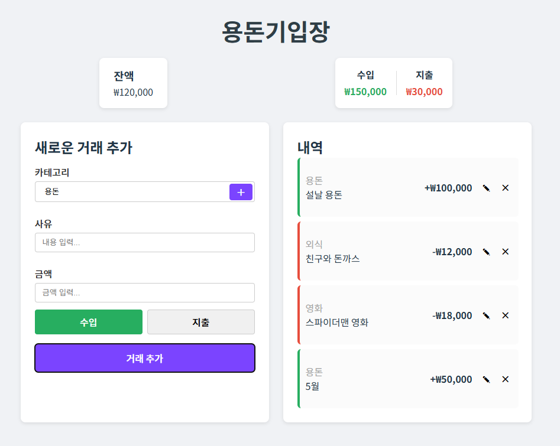

# 용돈 기입장
> 250425(금) LG유플러스 유레카 프론트엔드 과제

## 주요 특징
https://github.com/user-attachments/assets/3f206739-201d-4735-8352-2b9136685e8d

### 삭제 모달창

- 사유, 금액 조건검사
- 내역 수정 가능. 조건검사가 작은 토스트 창으로 보여짐. 1.8초 이후 사라짐
- 수입과 지출을 색으로 확인하기 위해 큰 버튼으로 변경
- 카테고리 추가
  - 카테고리 추가 버튼을 눌러 요소 추가 가능
- 전부 localStorage에 저장됨
- 모달 -> 카테고리 모달, 컨펌모달로 확장하여 사용

새로운 거래추가의 에러는 try catch 로 error를 잡아서 표현
카드 수정은 setError State를 통해 에러상태를 각 컴포넌트마다 상태로 관리
